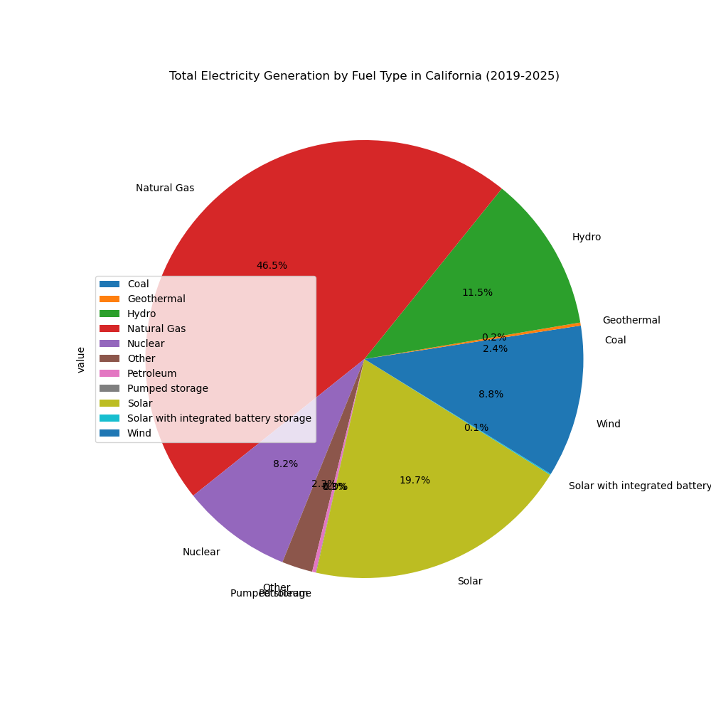

# Energy Demand Forecasting
This project forecasts daily electricity demand for the City of Los Angeles up to 30 days in advance using historical energy usage, weather data, and calendar-based features. Electricity demand varies significantly with weather, seasonality, and human behavior, and inaccurate forecasts can lead to overproduction, wasted resources, underproduction, service disruptions, and inefficient staffing or infrastructure planning. By applying data-driven forecasting techniques, this project demonstrates how utilities can improve operational planning, manage costs, and reduce the risk of outages through more accurate demand predictions.

### Exploratory Data analysis

