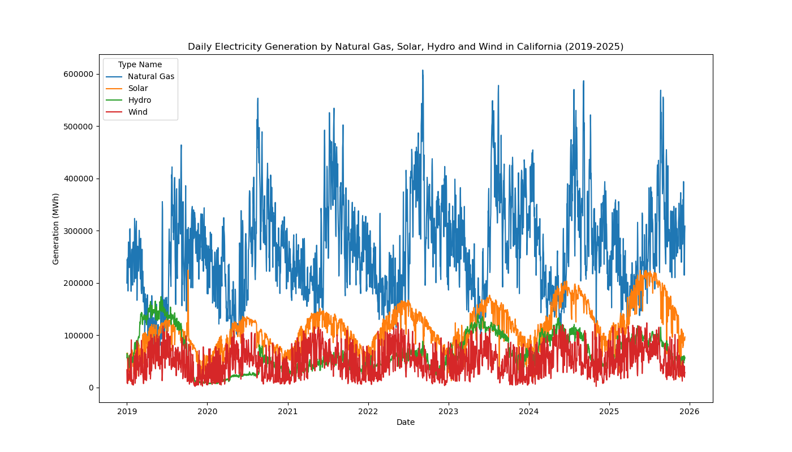
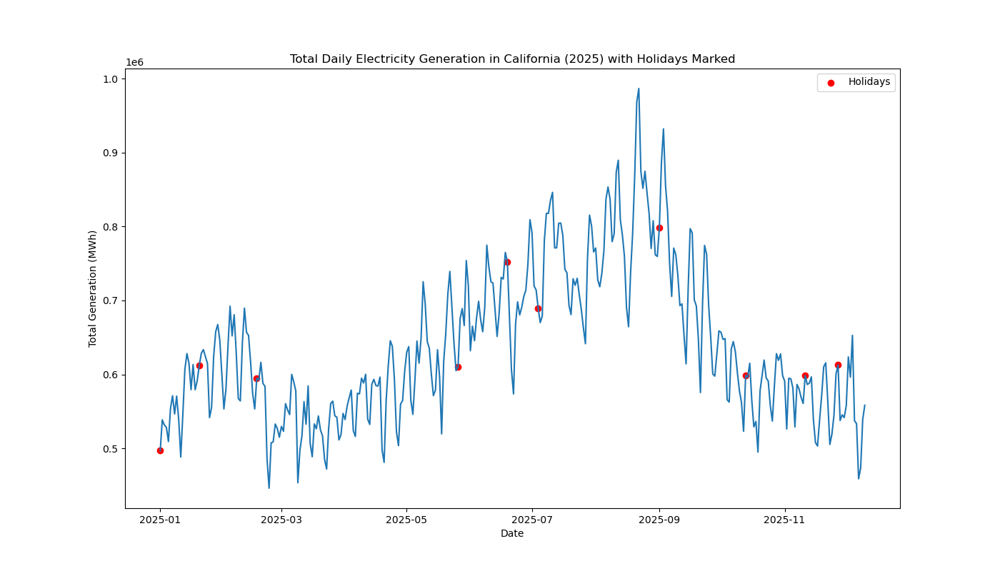
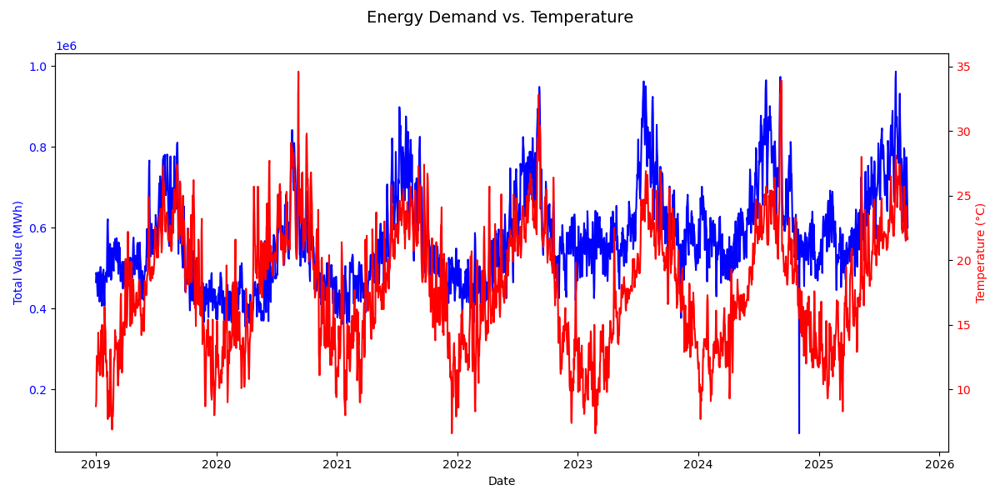
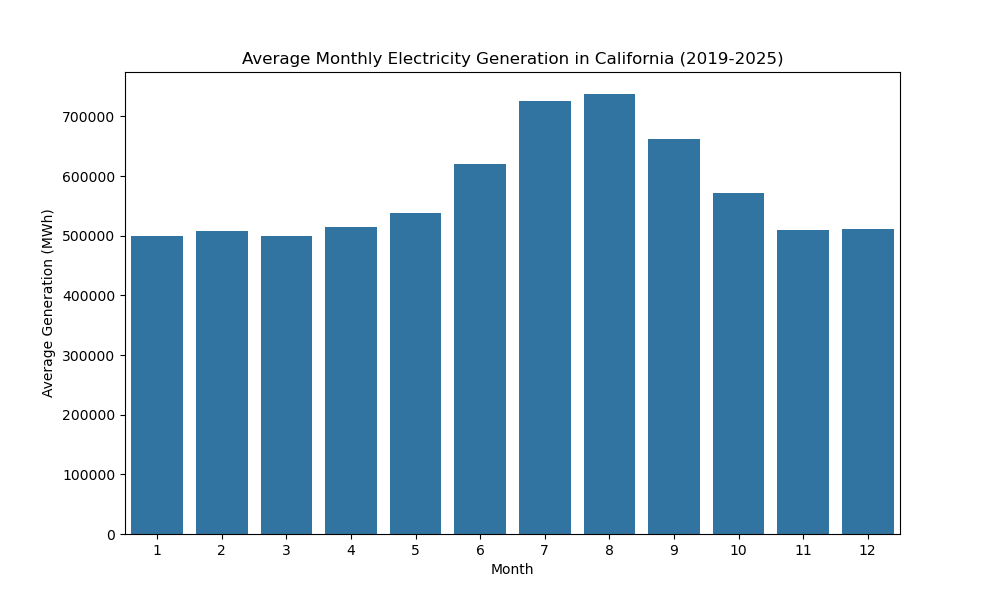
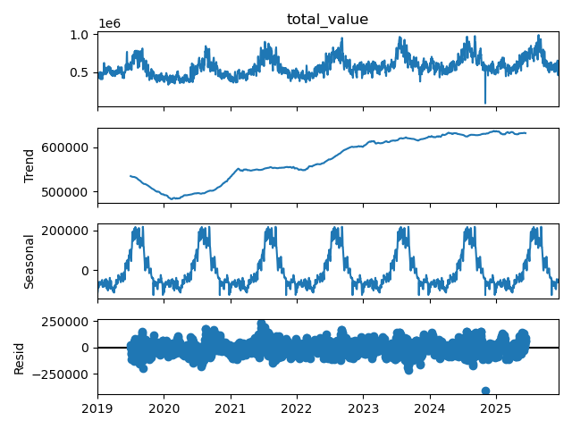
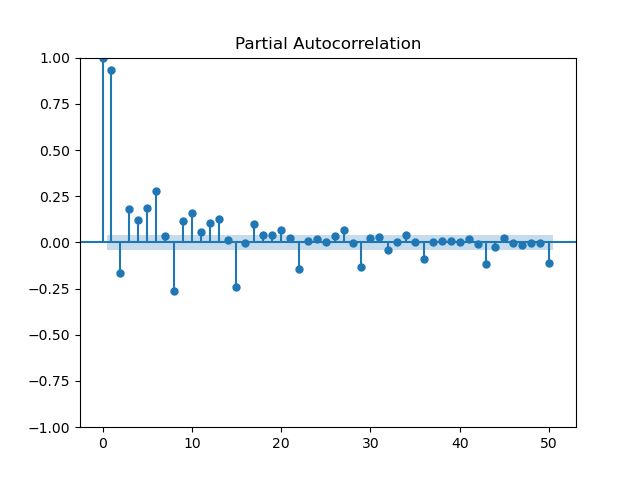

# Energy Demand Forecasting
This project forecasts daily electricity demand for the City of Los Angeles up to 30 days in advance using historical energy usage, weather data, and calendar-based features. Electricity demand varies significantly with weather, seasonality, and human behavior, and inaccurate forecasts can lead to overproduction, wasted resources, underproduction, service disruptions, and inefficient staffing or infrastructure planning. By applying data-driven forecasting techniques, this project demonstrates how utilities can improve operational planning, manage costs, and reduce the risk of outages through more accurate demand predictions.

### Exploratory Data analysis
<table>
  <tr>
    <td></td>
    <td></td>
  </tr>
  <tr>
    <td></td>
    <td></td>
  </tr>
</table>

* Natural gas is the dominant source of electricity generation, consistently providing the largest share relative to solar, hydro, and wind (top left).
* Natural gas generation exhibits clear seasonality, ramping up during the summer months (June–September) to accommodate increased electricity demand driven by cooling and air-conditioning usage (bottom left).
* In contrast, during cooler months (November–May), overall electricity demand declines and renewable energy sources account for a higher proportion of total generation, reducing reliance on natural gas (top right).
* The data shows that holidays cause significant peaks and valleys in electricity demand, making them a critical factor for accurate forecasting (bottom left).

### What features contribute to accurate forecasts?
<table>
  <tr>
    <td></td>
    <td></td>
  </tr>
  <tr>
    <td></td>
    <td></td>
  </tr>
</table>

* Electricity demand closely tracks temperature. When temperatures rise or fall, electricity generation tends to move in the same direction, reflecting similar seasonal patterns throughout the year.
* Peak electricity demand occurs in late summer to early fall.On average, electricity usage is highest between July and October, likely driven by cooling needs and increased activity during warmer months.
* Electricity demand is steadily increasing over time. The long-term trend shows a consistent upward growth in electricity generation across the years, with strong and predictable seasonal patterns. Short-term fluctuations remain stable and do not show increasing volatility.
* Demand today is strongly influenced by demand yesterday.
Electricity usage shows a strong dependence on the previous time period, meaning current demand can be well predicted using recent past demand.

### 7 Day Ahead Forecast
